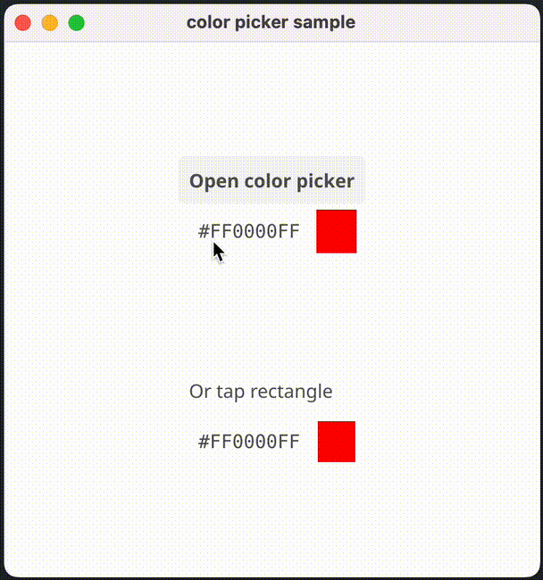
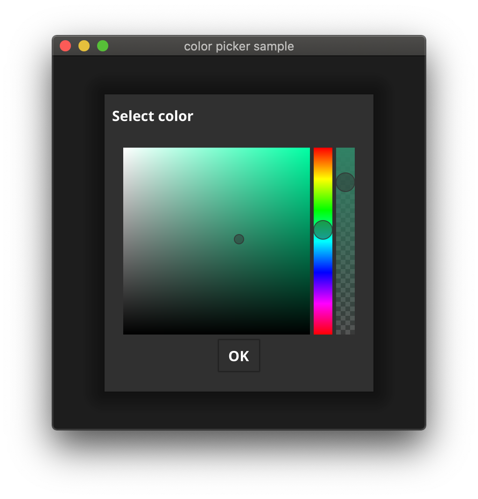

[](https://pkg.go.dev/github.com/lusingander/colorpicker?tab=doc)
[](https://goreportcard.com/report/github.com/lusingander/colorpicker)


# colorpicker

Color picker component for [Fyne](https://fyne.io/)



## Usage

```go
picker := colorpicker.New(200 /* height */, colorpicker.StyleHue /* Style */)
picker.SetOnChanged(func(c color.Color) {
    // called when the color is changed on the picker
    fmt.Println(c)
})

// you can use it just like any other Fyne widget
fyne.NewContainer(picker)
```

## Documentation

See [pkg.go.dev](https://pkg.go.dev/github.com/lusingander/colorpicker?tab=doc)

## Example

### colorpicker

You can see all the styles implemented.

[colorpicker/cmd/colorpicker/](./cmd/colorpicker/)


----

### colorpicker-popup

Example of embedding in Fyne's custom dialog.

[colorpicker/cmd/colorpicker-popup/](./cmd/colorpicker-popup/)


