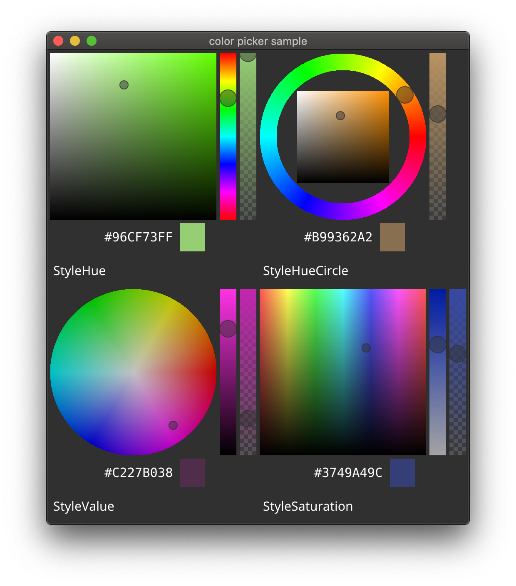

fyne-colorpicker
====

Color picker component for [Fyne](https://fyne.io/)

## Usage

```go
picker := colorpicker.NewColorPicker(200 /* height */, colorpicker.StyleCircle /* Style */)
picker.SetOnChanged(func(c color.Color) {
    // called when the color is changed on the picker
    fmt.Println(c)
})
```

## Example

[fyne-colorpicker/cmd/colorpicker/](./cmd/colorpicker/)


